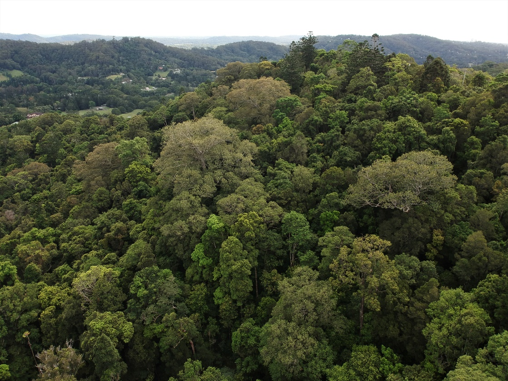

# Determinants of Forest Canopy Tree Height: Northern Rivers, NSW, Australia

This repository contains the scripts and workflows used in the paper "Determinants of forest canopy tree height: a case study in the Northern Rivers of NSW, Australia" (in review).  The scripts facilitate processing of LiDAR data to derive tree height and crowns, and subsequent boosted regression tree (BRT) modelling to explore the drivers of tree height and drone mapping scrips.

## Paper Reference

* **Title:** Determinants of forest canopy tree height: a case study in the Northern Rivers of NSW, Australia
* **Status:** In Review
* **Corresponding Author:** Dr Patrick Norman, Climate Action Beacon, Griffith University, email: p.norman@griffith.edu.au

## Data Availability

Once the paper has been published, links to the spatial data products generated during this study will be made available on this GitHub repository.

## Repository Contents

The repository is organized into the following directories:

* **`ALS_analysis_scripts/`**: Scripts and workflows for deriving tree height and crowns from LiDAR data.
    * `how_to_run.txt`:  A guide on how to execute the associated scripts.
    * `[Other script files and data files specific to tree height analysis]`
* **`Boosted_regression_tree_scripts/`**: Scripts for building and evaluating boosted regression tree models to assess the drivers of tree height.
    * `[Script files for BRT modelling, data preparation, and model evaluation]`
* **`Drone_related_scripts/`**: Scripts and workflows for drone flight planning and processing of drone imagery.
    * `[Script files and data files specific to drone flight and processing]`
* **`README.md`**: This file.

## Setup

The scripts are primarily written in Bash, R and Python. They rely on several external libraries and software packages including GDAL and PDAL.

* **Linux or WSL (on Windows)** 

## How to Run

Detailed instructions for running each analysis are provided in the `how_to_run.txt` files within their respective directories (`ALS_analysis_scripts/`, `Drone_related_scripts/`).  Please read these guides carefully before attempting to execute the scripts.

## License

* **`LICENSE`**:  Attribution-NonCommercial 4.0 International (CC BY-NC 4.0). You are free to share, copy and redistribute the material in any medium or format, and adapt, remix, transform, and build upon the material for non-commercial purposes, provided that you give appropriate credit by citing this repository. You may not use the material for commercial purposes. We do not guarantee their accuracy or precision of the outputs as they represent modelled data.

<!-- Add contact information for questions or collaboration -->
